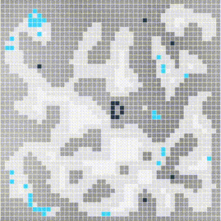
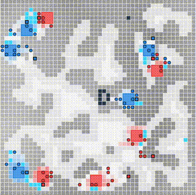
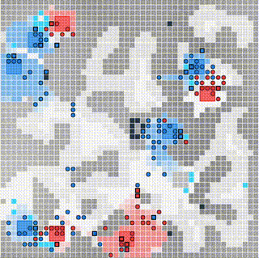
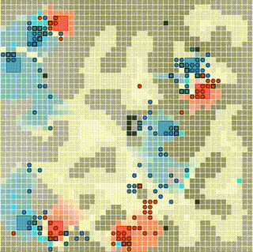

# LUX AI Season 2 Rule-based Agent (top 25 solution)
This is my agent for the [LuxAI 2023 Kaggle Competition](https://www.kaggle.com/competitions/lux-ai-season-2). 
The competition spanned several months, and my agent finished in 23rd place of 637 teams (top 4%), reaching a peak of 6th place at the end of the final sprint.
This was my first time ever competing in any sort of programming competition and my first time building an autonomous *agent* like this. I had never heard of Djikstra's 
algorithm or GOAP or really anything related to this sort of programming. It just seemed like an interesting challenge, and I'm thankful for the opportunity to have learned
about some really cool things.

The competition is described as follows from the link embedded above:

>The Lux AI Challenge is a competition where competitors design agents to tackle a multi-variable optimization, 
resource gathering, and allocation problem in a 1v1 scenario against other competitors. 
In addition to optimization, successful agents must be capable of analyzing their opponents and 
> developing appropriate policies to get the upper hand.

> In the Lux AI Challenge Season 2, two competing teams control a team of Factory and Robots that collect 
> resources and plant lichen, with the main objective to own as much lichen as possible at the end of the turn-based game. 
> Both teams have complete information about the entire game state and will need to make use of that information 
> to optimize resource collection, compete for scarce resources against the opponent, and grow lichen to score points. 
> Each competitor must program their own agent in their language of choice. Each turn, each agent gets 3 seconds 
> to submit their actions, excess time is not saved across turns.

>After 1000 turns, the winner is whichever team has the most lichen value on the map. 
> If any team loses all of their factories, they automatically lose and the other team wins. 
> If the lichen value is tied or both teams lose all their factories at the same time, then the game ends in a draw.

## Installation and Usage

Command to run the agent against itself:
```bash
luxai-s2 main.py main.py --out=replay.html
```

To view the replay, open the html file in a browser.

## Economy
The economy of the game focused around the circular concept that you need to spend energy to get energy and without energy you lose. This
creates quite the strategic problem: do you spend lots of energy to acquire lots of resources to generate lots energy so that 
you can perform lots of actions **OR** do you perform fewer actions which require less energy and thus less resources? In the 
end, the most successful agents used *a lot* of energy.

#### Resources
Around the map, you have light blue tiles that represent **ice** which can be mined and turned into **water** at a factory. The water can then be 
used to grow **lichen** which generates energy for the factory that "*owns*" the lichen. Robots can syphon energy from their factories, 
but they must be touching a factory tile to perform the exchange. Navy tiles represent **ore** which can be mined and turned into 
**metal** at a factory. That metal can be used to build more robots that can go out into the world and do *stuff* for you.

#### Doing Stuff
The game revolves around building robots to travel from factories to points of interest to perform some action then return back to the 
factory to refuel on energy and start the cycle over again. Since all actions/movements consume energy and the only way to generate energy is through
growing lichen and lichen requires water to grow, the single most important resource in the game is **ice**. Therefore, you will see most agents
build their factories near, or adjacent to, ice deposits to minimize the energy required to grow lichen. 

The most successful agents also spend 
resources to excavate **rubble** along the most efficient path to various points of interest because moving on top of rubble requires more energy proportional
to the amount of rubble on the tile. This upfront cost of excavating a path is outweighed by the efficiency of movement along that path for the rest of the game
**IF** that path ends up being used many times. 

This brings up the importance of **pathfinding**. Sometimes the *cheapest* path from an energy
perspective isn't necessarily the *shortest* path. So, how do you find the cheapest path? My solution revolves around the [*Djikstra Pathfinding Algorithm*](https://en.wikipedia.org/wiki/Dijkstra's_algorithm).
Djikstra's algorithm essentially looks at the current position and all possible movement options from that position, which on a grid where you can't move diagonally 
is just 4 directions(left, right, up, down), and picks the direction which is cheapest with a weight on picking the direction which is closest to the final destination.

The game treats all actions as part of a **queue** and puts a cost on updating the queue. This forced the most successful agents to develop a **queueing** system
that creates the longest queue possible so that they can avoid updating it and incurring the update cost. This requires predicting where to move, how to move there, and what the gamestate
will be like many turns into the future. My queueing system is oriented around the [GOAP(Goal Oriented Action Planning)](https://www.youtube.com/watch?v=gm7K68663rA) paradigm. 
Essentially, each robot descends through a decision tree which determines what 
goals it should be trying to accomplish given the state of the game at the moment of decision as well as the predicted game state in the future, 
then generates a queue of all the sequential actions which must take place for those goals to 
be accomplished. If the queue gets interrupted at any point during execution of the queue, then the decision-making process starts from scratch given that the game environment has 
evolved since generating the original goal. 


## Strategy
Though this competition presented many technical challenges, it also provided a great opportunity to explore various 
strategic concepts. Throughout the course of the competition, the **meta** of the field evolved in many interesting ways.
Initially, the field was dominated by agents that focused entirely on resource collection and expansion. Any energy expended was used
either to acquire resources, primarily ice to turn into water, or excavating rubble from the areas immediately surrounding
a factory. Rubble excavation was vital as you could not grow lichen on a tile that had more than 0 rubble.

This was a natural starting point as having the most lichen is the primary objective of the game. 
However, as the competition progressed, it became clear that the most successful agents would not only focus on resource
collection, but also on resource denial. This trend started with agents that would sacrifice all but one of their factories
in order to devote all of their energy to destroying the opponent's robots, thus denying them the ability to collect resources 
and keep their factories alive. Once this strategy became popular, it was quickly countered by agents that would defend their
factories by deploying robots to antagonize the robots that were sent to antagonize them. As I'm sure you can imagine, this
escalated quickly, and the meta evolved into a game of cat and mouse where the goal was to keep your robots alive while
destroying(or otherwise distracting) the opponent's robots.

There also came the concept of efficiency in regard to resource collection. Since moving a robot costs energy, and it costs 
more energy to move on tiles with higher amounts of rubble, it became important to minimize both the amount steps spent traveling 
from one place to another and the amount of rubble that the robots would have to traverse. This led to the development
of agents that would excavate pathways to nearby resources, allowing their robots to travel more efficiently from resource to factory.
Also, since you could not move a factory once it had been placed, it was important to place factories in locations that
were both close to resources and in areas of the map that had minimal rubble.

The heuristics involved in making all of these decisions: where to place your factories, where to build your pathways and which
resource tiles to build them to, which robots to send to which locations, which robots to defend your factories with, 
which robots to mine resources with, which resources to mine at any given time etc. all became very complex. This is made more 
complex by the fact that no two maps are identical, and your agent must respond to the opponent while also responding to the ever
evolving state of the map as rubble gets excavated and pathways get opened or blocked.

## My Approach
Here I will show you my approach to the problem, and how I was able to achieve a top 25 finish. This will represent the finished
product of my agent, but it is important to note that this underwent many iterations and improvements throughout the course of the competition.

### Factory Placement
The first several turns of every match were dedicated to placing factories. I used a set of heuristics to determine where to place
factories based on a total score for each tile which consisted of the following components: nearness to resources(with an emphasis on ice), 
nearness to other factories, and how much rubble was in the surrounding area. The nearness to resources was calculated by finding the
distance to the closest few tiles of each resource and weighing them based on the type of resource. The nearness to other factories played a
smaller role in the overall score, but still had an impact. The amount of rubble in the surrounding area was calculated by finding tiles that 
were completely clear of rubble and giving them a score that increased if there were more clear tiles in the surrounding area. 
Since every aspect of the game revolved around having water to sustain your factories, I placed a heavy emphasis on placing factories
directly adjacent to an ice tile. This way each factory could have a robot dedicated to mining ice virtually all the time.



### Early Game
Pathway building, resource collection, and robot deployment were the primary focuses of the early game.



### Mid Game
The mid-game was all about resource denial and resource collection. Robots are extremely valuable and must be protected at all costs.



### Late Game
The late game was all about destroying enemy lichen and growing as much lichen as possible. Robots become expendable at this point as
you get no bonus points for having robots at the end of the game. The only thing that matters is how much lichen you have vs how much lichen
your opponent has.


